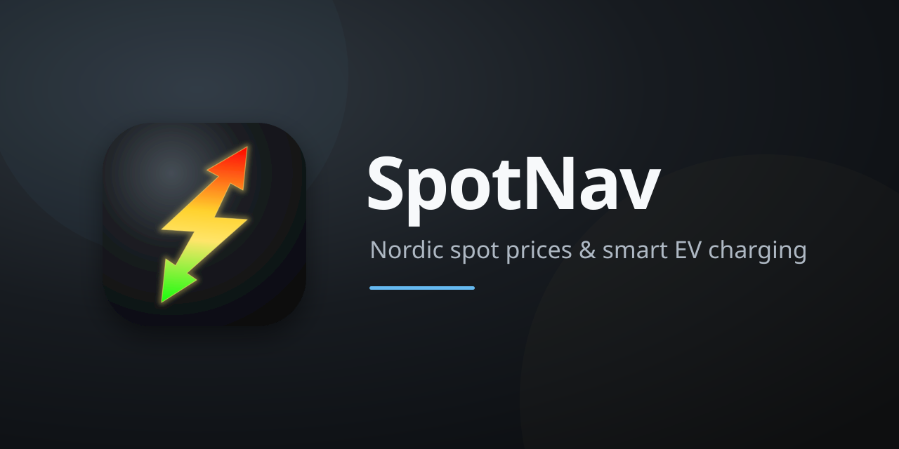
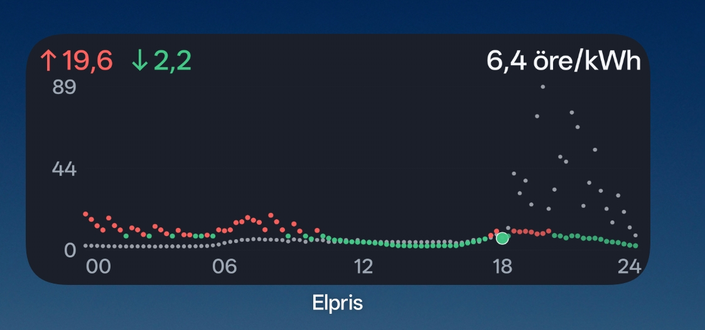
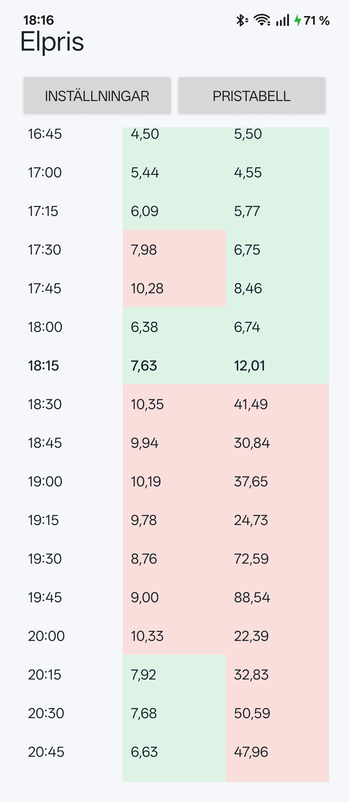
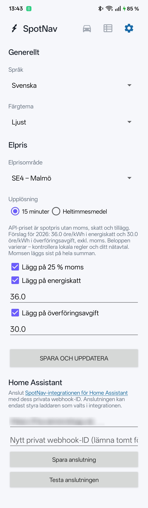
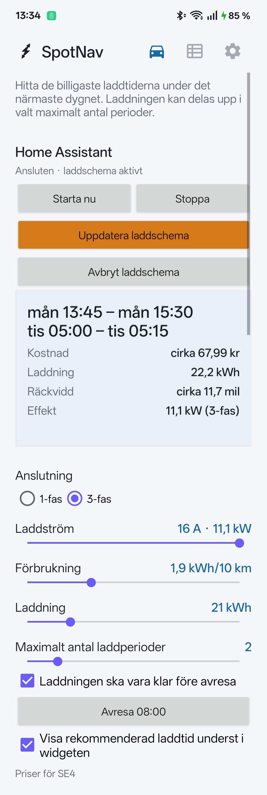

<p align="center">
  
</p>

[English documentation](README.md)

En anpassningsbar Android-widget som visar spotpriser för idag och imorgon på samma 24-timmarsaxel. Appen stöder svenska SE1–SE4, norska NO1–NO5, danska DK1–DK2 och Finland samt svenska, norska, danska, finska och engelska.

<p align="center">
  
</p>

## Funktioner

- Överlagrade kvartskurvor för idag och imorgon. Morgondagen visas som ljusa grå punkter bakom dagens priser.
- Aktuell kvart markeras med en större punkt; dygnets min-, max- och aktuella pris visas överst.
- Val mellan 15-minuterspriser och heltimmesmedel.
- Separata inställningar per widget för svenska SE1–SE4, norska NO1–NO5, danska DK1–DK2 och Finland.
- Språkval för svenska, norska, danska, finska och engelska; valt språks land visas först bland elområdena.
- Valfri moms, energiskatt och överföringsavgift.
- Pristabell med idag och imorgon sida vid sida, färgkodning, markerad aktuell rad och automatisk scrollning till aktuell tid.
- Elbilsplanering för en- eller trefasladdning som optimerar upp till åtta laddperioder utifrån laddström, önskad energi och bilens förbrukning.
- Valfri laddrekommendation direkt under grafen i widgeten.
- Storleksanpassningsbar widget för olika launchers och skärmstorlekar.
- Persistent lokal cache: senast hämtade priser finns kvar vid tillfälliga nätverksfel.
- Automatiska publiceringskontroller från 13:00 och fortsatta återförsök tills morgondagens priser har hämtats.

<p align="center">
  
  &nbsp;&nbsp;
  
</p>

## Användning

1. Installera APK-filen från projektets [Releases](../../releases).
2. Lägg till **SpotNav** från startskärmens widgetväljare.
3. Välj elområde, upplösning och eventuella påslag.
4. Tryck på widgeten för att öppna inställningar, pristabell och elbilsplanering.

## Elbilsplanering

På fliken **Elbil** väljer du en- eller trefasladdning (6–16 A), bilens ungefärliga förbrukning i kWh/mil, hur många kWh du vill ladda och maximalt en till åtta laddperioder. Du kan ange en avresetid så att laddningen alltid hinner bli klar; nästa förekomst av det valda klockslaget används. Appen väljer den billigaste kombinationen av kvartar, visar räckvidd och kostnad och kan markera perioderna med svagt blå bakgrund i widgeten. Om laddningen sträcker sig förbi publicerade priser uppskattas de saknade kvartarna från det senast publicerade dygnets prisprofil och kostnaden märks tydligt som uppskattad.

Beräkningen utgår från 230 V enfas eller 400 V trefas och ideal laddningseffekt. Verklig effekt, laddförlust och bilens laddkurva kan göra laddningen något långsammare. Tider och kostnader är därför ungefärliga.

### Home Assistant-styrning

SpotNav kan skicka de beräknade laddperioderna och laddkommandon till den separata [SpotNav charging control-integrationen](https://github.com/henrikekblad/spotnav-home-assistant). Schemat sparas och utförs av Home Assistant och är därför inte beroende av att telefonen förblir ansluten.

Installera integrationen genom HACS och välj laddarens styrentiteter. Öppna därefter integrationens entitet **Appanslutning** i Home Assistant och kopiera attributet `webhook_id`. Ange Home Assistant-adressen och detta webhook-ID under **Inställningar → Home Assistant** i SpotNav och tryck **Testa anslutningen**. Internetadresser kräver HTTPS; privata lokala IP-adresser och lokala värdnamn kan använda HTTP. Appen lagrar varken lösenordet till ditt Home Assistant-konto eller någon generell åtkomsttoken.

Under Elbil ställer **Starta nu** först in det amperetal som är valt i appen och aktiverar sedan laddningen. Schemaknappen visar om appens beräknade perioder är synkroniserade med Home Assistant eller behöver skickas/uppdateras.

Webhook-ID:t är en genererad hemlighet för SpotNav-integrationen, inte en vanlig HA-token. Det är begränsat till laddaren som valts i integrationen och tar bara emot status-, schema-, avbryt-, start- och stoppkommandon. Publicera det inte och visa det inte i skärmbilder.

<p align="center">
  
</p>

Flera widgetinstanser kan använda olika elområden och avgifter.

## Prismodell

Priserna hämtas från de öppna API:erna hos [elprisetjustnu.se](https://www.elprisetjustnu.se/), [hvakosterstrommen.no](https://www.hvakosterstrommen.no/), [elprisenligenu.dk](https://www.elprisenligenu.dk/) och [sahkonhintatanaan.fi](https://www.sahkonhintatanaan.fi/). Appen visar lokal valuta: SEK, NOK, DKK eller EUR.

API-värdet är spotpris utan moms, skatter och tillägg. Appen räknar om valutaenheten till öre/cent och tillämpar valda påslag enligt:

```text
(spotpris × 100 + energiskatt + överföringsavgift) × moms
```

Moms multipliceras sist och följer valt land (25 % i Sverige, Norge och Danmark, 25,5 % i Finland samt 0 % i norska NO4). Fasta månadsavgifter ingår inte eftersom de inte kan uttryckas korrekt per kWh utan en förbrukningsprognos. Kontrollera beloppen mot ditt elnätsavtal och aktuella lokala skatteregler.

Appen fyller i redigerbara landsanpassade förslag för energiskatt. För Sverige föreslås 36,0 öre/kWh i ordinarie energiskatt och 30,0 öre/kWh i överföringsavgift, båda exklusive moms. Nätavgiften lämnas som 0 i övriga länder eftersom den beror på nätbolag, tariff och kundavtal.

## Bygga lokalt

Krav:

- JDK 17
- Android SDK 36

Bygg en debug-APK:

```bash
./gradlew assembleDebug
```

APK:n skapas i `app/build/outputs/apk/debug/`.

## Uppdateringar och cache

Android begär normalt widgetuppdatering ungefär var 30:e minut, men systemet kan senarelägga körningar för att spara batteri. Appen gör dessutom särskilda kontroller kring morgondagens publicering och fortsätter var 30:e minut tills ett komplett morgondagsdygn har sparats.

Lyckade API-svar cachas lokalt per datum och elområde. Appen samlar inte in eller skickar någon användardata.

## Felsökning

Relevanta Android-loggar kan läsas med:

```bash
adb logcat -d | grep -E 'SpotNavRepository|SpotNavWidget|SpotNavScheduler'
```

Loggarna innehåller URL, HTTP-status, antal parsade priser, cacheträffar och nästa schemalagda kontroll – men inga lösenord eller personuppgifter.

## Datakälla och ansvar

Prisdata tillhandahålls av [Elpriset just nu](https://www.elprisetjustnu.se/elpris-api). Projektet är inte anslutet till dataleverantören, Nord Pool, något elbolag eller elnätsföretag. Uppgifterna är vägledande; kontrollera alltid ditt avtal och din faktura.

## Licens

Projektet distribueras under [MIT-licensen](LICENSE).
